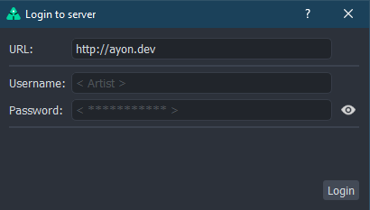

import Tabs from '@theme/Tabs';
import TabItem from '@theme/TabItem';

## Introduction

:::note Future releases of AYON
Most of what is described here will change a lot in future releases where addons will be split to different repositories and dependencies will be processed by server.
:::

To build AYON you currently need (on all platforms):

- **[Python 3.9](https://www.python.org/downloads/)** as we are following [vfx platform CY2022](https://vfxplatform.com).
- **[git](https://git-scm.com/downloads)**

We use [CX_Freeze](https://cx-freeze.readthedocs.io/en/latest) to freeze the Python code and all of its dependencies and [Poetry](https://python-poetry.org/) for virtual environment management.

This is the  outline of build steps. Most of them are done automatically via scripts:

- Virtual environment is created using **Poetry** in `.venv`
- Necessary Python modules outside of `.venv` are stored to `./vendor/python` (like `PySide2`)
- Necessary third-party tools (like [ffmpeg](https://www.ffmpeg.org/), [OpenImageIO](https://github.com/OpenImageIO/oiio)
  and default OCIO configs are downloaded to `./vendor/bin`
- AYON code is frozen with **cx_freeze** to `./build`
- Modules are moved from `lib` to `dependencies` to solve some Python 2 / Python 3 clashes
- On macOS application bundle and dmg image will be created from frozen and built code.
- On Windows, you can create executable installer with `./tools/build_win_installer.ps1`[^1]

### Clone AYON desktop repository (currently still called OpenPype)

```powershell
git clone --recurse-submodules https://github.com/ynput/OpenPype.git
```

## Platform specific steps

<Tabs
  groupId="platforms"
  defaultValue="win"
  values={[
    {label: 'Windows', value: 'win'},
    {label: 'Linux', value: 'linux'},
    {label: 'Mac', value: 'mac'},
  ]}>

<TabItem value="win">

### Windows

#### Managing Python with pyenv-win

To manage your Python version, we recommend using [pyenv-win](https://github.com/pyenv-win/pyenv-win). It provides
management of multiple versions of Python per project/folder and is very easy to use.

To install it, just run this in your **PowerShell**[^2]:

```powershell
Invoke-WebRequest -UseBasicParsing -Uri "https://raw.githubusercontent.com/pyenv-win/pyenv-win/master/pyenv-win/install-pyenv-win.ps1" -OutFile "./install-pyenv-win.ps1"; & "./install-pyenv-win.ps1"
```

You need to re-open your shell. After that, you'll be able to run `pyenv --version` to check if the installation was
successful.

List all supported version of Python by running:

 ```powershell
 pyenv install --list | Select-String "3.9."
 ```

 It is usually good idea to pick the latest one from 3.9 - be aware that AYON is not compatible with 32-bit versions, so choose the one without `win32` string in it.

Once you've chosen your version, install it running:

```powershell

pyenv install <version>
```

Now, to enable that version of Python of AYON, change your current directory to location where you've cloned git
repository and run:

```powershell
pyenv local <version>
```

Where `<version>` is the version of Python you've installed with **pyenv**. You can verify that all is working by running `python -V` - it should print out the exact version you've selected. Once you've installed and selected 
right version of Python, you can try to run AYON from sources.

#### Run from sources

For development purposes it is possible to run AYON directly from the sources. We provide a simple launcher script for this. To run the powershell scripts you may have to enable unrestricted execution as administrator:

```powershell
Set-ExecutionPolicy -ExecutionPolicy unrestricted
```

To start AYON from source you need to:

1. Run `.\tools\create_env.ps1` to create virtual environment using Poetry in `.venv`
2. Run `.\tools\fetch_thirdparty_libs.ps1` to get **PySide2**, **ffmpeg**, **oiio** and other tools needed.
3. Run `.\tools\run_tray_ayon.ps1`[^3] if you have all required dependencies on your machine you should be greeted with AYON login window and once you give it your server URL and user credentials, with AYON icon in the system tray.

<div class="col col--6 markdown">



</div>

Step 1 and 2 needs to be run only once (or when something was changed in `pyproject.toml`).
Once you've successfully run AYON to test that everything is set alright, you can proceed to build:

#### Build AYON on Windows

Just make sure you've already ran:

1. Run `.\tools\create_env.ps1` to create virtual environment using Poetry in `.venv`
2. Run `.\tools\fetch_thirdparty_libs.ps1` to get **PySide2**, **ffmpeg**, **oiio** and other tools needed.

To build AYON from sources, run:

```powershell
.\tools\build.ps1
```

Resulting build can be found in `.\build`.

</TabItem>
<TabItem value="linux">

### Linux

#### Docker

You can use Docker to build AYON. Just run:

```shell
sudo ./tools/docker_build.sh
```

This will by default use Ubuntu as a base image. If you need to make Centos 7 compatible build, please run:

```sh
sudo ./tools/docker_build.sh centos7
```

and you should have built AYON in `./build` directory. It is using **Centos 7**
as a base image.

Beware that as Python is built against some library versions in Centos 7 base image,
those might not be available in linux version you are using. We try to handle those we
are able to find (libffi, libcrypto/ssl, etc.) but there might be more.

There is also Debian variant:

```sh
sudo ./tools/docker_build.sh debian
```

You can manually tweak build steps in corresponding `Dockerfile` files if needed.

#### Manual build

To build AYON on Linux you will need:

- **[curl](https://curl.se)** on systems that doesn't have one preinstalled.
- **bzip2**, **readline**, **sqlite3** and other libraries.

Because some Linux distros come with older Python version pre-installed, you might
need to install **3.9** version and make use of it explicitly.
Your best bet is probably using [pyenv](https://github.com/pyenv/pyenv).

You can use your package manager to install **git**, **pyenv** and other packages to your build
environment.

#### Common steps for all Distros

Use pyenv to prepare Python version for AYON build. Skip if pyenv is installed using system package manager.

```shell
$ curl https://pyenv.run | bash

# you can add those to ~/.bashrc
$ export PATH="$HOME/.pyenv/bin:$PATH"
$ eval "$(pyenv init -)"
$ eval "$(pyenv virtualenv-init -)"

# reload shell
$ exec $SHELL

# install Python 3.9.13
# Python will be downloaded and build so please make sure
# you have all necessary requirements installed (see below).
$ pyenv install -v 3.9.13

# change path to AYON
$ cd /path/to/ayon

# set local python version
$ pyenv local 3.9.13
```

:::note Install build requirements for **Ubuntu**

```shell
sudo apt-get update; sudo apt-get install --no-install-recommends make build-essential libssl-dev zlib1g-dev libbz2-dev libreadline-dev libsqlite3-dev wget curl llvm libncurses5-dev xz-utils tk-dev libxml2-dev libxmlsec1-dev libffi-dev liblzma-dev git patchelf
```

In case you run in error about `xcb` when running AYON,
you'll need also additional libraries for Qt5:

```shell
sudo apt install qt5-default
```

:::

:::note Install build requirements for **Centos 7**

```shell
$ sudo yum install https://dl.fedoraproject.org/pub/epel/epel-release-latest-7.noarch.rpm
$ sudo yum install centos-release-scl
$ sudo yum install bash which git devtoolset-7-gcc* \
        make cmake curl wget gcc zlib-devel bzip2 \
        bzip2-devel readline-devel sqlite sqlite-devel \
        openssl-devel tk-devel libffi-devel qt5-qtbase-devel \
        patchelf
```

:::

:::note Install build requirements for other Linux variants

Build process usually needs some reasonably recent versions of libraries and tools. You
can follow what's needed for Ubuntu and change it for your package manager. Centos 7 steps
have additional magic to overcame very old versions.
:::

For more information about setting your build environment please refer to [pyenv suggested build environment](https://github.com/pyenv/pyenv/wiki#suggested-build-environment).

#### Build AYON on Linux

1. Run `./tools/create_env.sh` to create virtual environment in `./venv`
2. Run `./tools/fetch_thirdparty_libs.sh` to get **PySide2**, **ffmpeg**, **oiio** and other tools needed.
3. Run `./tools/build.sh` to build AYON executables in `.\build\`

</TabItem>
<TabItem value="mac">

### macOS

To build AYON on macOS you will need:

- **[Homebrew](https://brew.sh)** - easy way of installing everything necessary.
- **[CMake](https://cmake.org/)** to build some external AYON dependencies.
- **XCode Command Line Tools** (or some other build system)
- **[create-dmg](https://formulae.brew.sh/formula/create-dmg)** to create dmg image from application
bundle.

- Install **Homebrew**:

```shell
/bin/bash -c "$(curl -fsSL https://raw.githubusercontent.com/Homebrew/install/HEAD/install.sh)"
```

- Install **cmake**:

```shell
brew install cmake
```

- Install [pyenv](https://github.com/pyenv/pyenv):

```shell
brew install pyenv
echo 'eval "$(pyenv init -)"' >> ~/.zshrc
pyenv init
exec "$SHELL"
PATH=$(pyenv root)/shims:$PATH
```

- Pull in required Python version 3.9.x

```shell
# install Python build dependencies
$ brew install openssl readline sqlite3 xz zlib

# replace with up-to-date 3.9.x version
$ pyenv install 3.9.6
```

- Set local Python version in cloned AYON repository

```shell
pyenv local 3.9.6
```

- Install `create-dmg`

```shell
brew install create-dmg
```

#### To build AYON on macOS:

1. Run `./tools/create_env.sh` to create virtual environment in `./venv`.
2. Run `./tools/fetch_thirdparty_libs.sh` to get **ffmpeg**, **oiio** and other tools needed.
3. Run `./tools/build.sh` to build AYON Application bundle in `./build/`.

:::warning macOS App is currently broken
Since 3.15 there is an issue with application built on macOS that it refuses to launch by
clicking on it. Current workaround is to launch it directly, for example using Terminal:

```shell
open /Applications/OpenPype\ v3.15.3.app/Content/MacOS/ayon_gui
```

Use the same command with `openpype_gui` to run in OpenPype mode.

:::

</TabItem>
</Tabs>

## Creating distributable AYON zip version

To create distributable AYON versions, run `./tools.create_zip.ps1` - that will
create zip file with name `OpenPype-vx.x.x.zip` parsed from current AYON repository and
copy it to user data dir[^4]. You can specify `--path \path\to\zip` to force it into a different
location. This can be used to prepare new version releases for artists in the studio environment
without the need to re-build the whole package. Note that you don't need to build AYON beforehand,
as this is only using source files.

:::note Checksum and local changes
When this zip file is created, checksums of all included files are calculated and included in zipped file
so whenever this version is used, its integrity is validated. If you decide to change some files locally
(to test something), you can just delete `checksums` file and validation would be skipped. This is mostly
useful for quick debugging, but should be avoided on production cases.
:::

## Adding dependencies

### Python modules

If you are extending AYON and you need some new modules not included, you can add them
to `pyproject.toml` to `[tool.poetry.dependencies]` section.

```toml title="/pyproject.toml"
[tool.poetry.dependencies]
python = "3.9.*"
aiohttp = "^3.7"
aiohttp_json_rpc = "*" # TVPaint server
acre = { git = "https://github.com/ynput/acre.git" }
opentimelineio = { version = "0.14.0.dev1", source = "ayon" }
#...
```

It is useful to add comment to it so others can see why this was added and where it is used.
As you can see you can add git repositories or custom wheels (those must be
added to `[[tool.poetry.source]]` section).

To add something only for specific platform, you can use markers like:

```toml title="Install pywin32 only on Windows"
pywin32 = { version = "300", markers = "sys_platform == 'win32'" }
```

For more information see [Poetry documentation](https://python-poetry.org/docs/dependency-specification/).

### Python modules as third-party

There are some python modules that can be available only in AYON and should not be propagated to any subprocess.
Best example is **PySide2** which is required to run AYON but can be used only in AYON and should not be in `PYTHONPATH` for most of host applications.
We've decided to separate these breaking dependencies to be able run AYON from code and from build the same way.

:::info
**PySide2** has handled special cases related to it's build process.

### Qt bindings on Linux

We're fixing `rpath` of shared objects on linux which is modified during cx freeze processing.

### Qt bindings on macOS

We are using PySide6 on macOS because of compatibility with M1/M2 CPUs. **QtSql** libraries are removed on macOS because their dependencies are not available and would require to modify `rpath` of Postgres library.
:::

### Binary dependencies

To add some binary tool or something that doesn't fit standard Python distribution methods, you
can use [fetch_thirdparty_libs](#fetch_thirdparty_libs) script. It will take things defined in
`pyproject.toml` under `[openpype]` section like this:

```toml title="/pyproject.toml"
[ayon]

[ayon.thirdparty.ffmpeg.windows]
url = "https://distribute.ayon.io/thirdparty/ffmpeg-4.4-windows.zip"
hash = "dd51ba29d64ee238e7c4c3c7301b19754c3f0ee2e2a729c20a0e2789e72db925"
# ...
```

This defines FFMpeg for Windows. It will be downloaded from specified url, its checksum will
be validated (it's sha256) and it will be extracted to `/vendor/bin/ffmpeg/windows` (partly taken
from its section name).

## Script tools

(replace extension with the one for your system - `ps1` for windows, `sh` for linux/macos)

### build

This will build AYON to `build` directory. If virtual environment is not created yet, it will
install [Poetry](https://python-poetry.org/) and using it download and install necessary
packages needed for build. It is recommended that you run [fetch_thirdparty_libs](#fetch_thirdparty_libs)
to download FFMpeg, OpenImageIO and others that are needed by AYON and are copied during the build.

#### build arguments

`--no-submodule-update` - to disable updating submodules. This allows to make custom-builds for testing
feature changes in submodules.

---

### build_win_installer

This will take already existing build in `build` directory and create executable installer using
[Inno Setup](https://jrsoftware.org/isinfo.php) and definitions in `./inno_setup.iss`. You need AYON
build using [build script](#build), Inno Setup installed and in `PATH` before running this script.

:::note
Windows only
:::

---

### create_env

Script to create virtual environment for build and running AYON from sources. It is using
[Poetry](https://python-poetry.org/). All dependencies are defined in `pyproject.toml`, resolved by
Poetry into `poetry.lock` file and then installed. Running this script without Poetry will download
it, install it to `.poetry` and then install virtual environment from `poetry.lock` file. If you want
to update packages version, just run `poetry update` or delete lock file.

#### create_env arguments

`--verbose` - to increase verbosity of Poetry. This can be useful for debugging package conflicts.

---

### create_zip
Script to create packaged AYON version from current sources. This will strip developer stuff and
package it into zip that can be used for [auto-updates for studio wide distributions](admin_distribute.md#automatic-updates), etc.

Alternative (but without clearing Python caches):

```shell
poetry run python ./tools/create_zip.py
```

---

### docker_build.sh *[variant]*

Script to build AYON on [Docker](https://www.docker.com/) enabled systems.

It must be run with administrative privileges - `sudo ./docker_build.sh`.

It will use **Ubuntu** base image to build AYON. If you need to build AYON for
other systems like Centos 7, use `centos7` as argument. There is also Debian varinat with `debian` argument. This will use another Dockerfile to build AYON with **Centos 7** or **Debian** as base image.

Result is copied from build container to `./build` directory.

:::note
This script has no equivalent in PowerShell
:::

---

### fetch_thirdparty_libs

This script will download necessary tools for AYON defined in `pyproject.toml` like FFMpeg,
OpenImageIO, Qt bindings (PySide2/6) and OCIO configs and put them to `./vendor/bin`. Those are then included in build.
Running it will overwrite everything on their respective paths.

---

### make_docs

Script will run [sphinx](https://www.sphinx-doc.org/) to build API documentation in html. You
should see it then under `./docs/build/html`.

---

### run_mongo

:::note
This is useful only for local testing of OpenPype. For AYON, it doesn't have any effect.
:::

Helper script to run local mongoDB server for development and testing. You will need
[mongoDB server](https://www.mongodb.com/try/download/community) installed in standard location
or in `PATH` (standard location works only on Windows). It will start by default on port `2707` and
it will put its db files to `../mongo_db_data` relative to AYON sources.

---

### run_project_manager

:::note
This is useful only for OpenPype. For AYON, it doesn't have any effect.
:::

Helper script to start AYON Project Manager tool.
Same as:

```shell
poetry run python start.py projectmanager
```

---

### run_settings

:::note
This is useful only for OpenPype. For AYON, it doesn't have any effect.
:::

Helper script to open AYON Settings UI.
Same as:

```shell
poetry run python start.py settings --dev
```

---

### run_tests

Runs AYON test suite.

---

### run_tray

:::note
This is useful only for OpenPype. For AYON, it doesn't have any effect.
:::

Helper script to run OpenPype Tray.

---

### run_ayon_tray

Helper script to run AYON Desktop application.

---

### update_submodules

Helper script to update AYON git submodules.
Same as:

```shell
git submodule update --recursive --remote
```

[^1]: For Windows installer, you need [Inno Setup](https://jrsoftware.org/isdl.php)
[^2]: To run the powershell scripts you may have to enable unrestricted execution as administrator `Set-ExecutionPolicy -ExecutionPolicy unrestricted`
[^3]: There is for transition period from OpenPype to AYON also `.\tools.\run_tray.ps1` script to run AYON in OpenPype mode (ie. with connection to MongoDB)
[^4]: User data directory on Windows is set by `%LOCALAPPDATA%` system environment variable.
