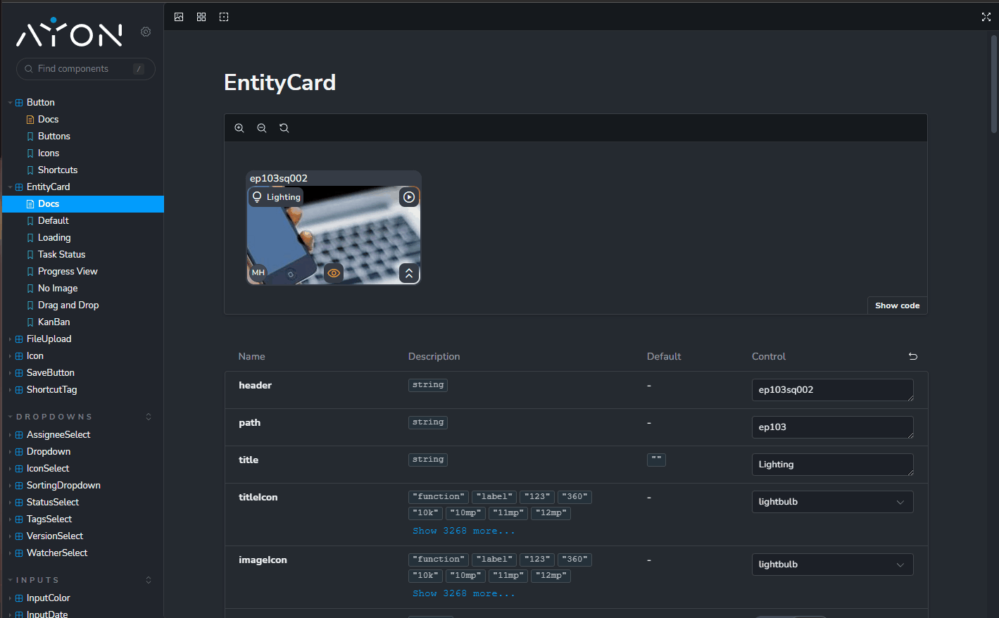

## About AYON React Components

The [AYON Component Library](https://github.com/ynput/ayon-react-components) is a collection of components for the AYON project. It's extensively used in our [ayon-frontend](https://github.com/ynput/ayon-frontend), the React frontend code for the Ayon server.
It can be used to create consistent and accessible AYON addons.

## Get Started

You can find examples for creating a Frontend React App for addons in [Addon Frontend Dev](dev_addon_creation.md#react-app).
Once set up, you can try different AYON components.

:::tip
Our [AYON React Components Docs](https://components.ayon.dev/?path=/docs/button--docs) provide examples you can copy and paste directly into your React app for easy experimenting.

Remember to import the component into your code, as it's not copied by default. For the following [EntityCard](https://components.ayon.dev/?path=/docs/entitycard--docs) example in the screen grab, use:

```js
import { EntityCard } from '@ynput/ayon-react-components'
```


:::

## Learn More
You can find the full list of components and their documentation at [AYON React Components Docs](https://components.ayon.dev/?path=/docs/button--docs)

:::tip
To run Documentation locally follow [Get Started with Storybook](https://github.com/ynput/ayon-react-components?tab=readme-ov-file#get-started-with-storybook) on GitHub.
:::