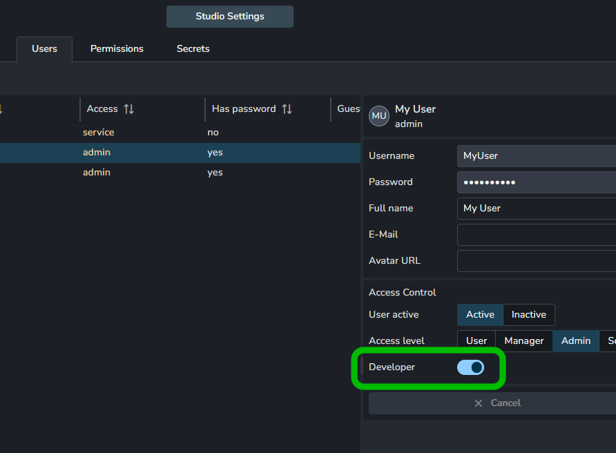
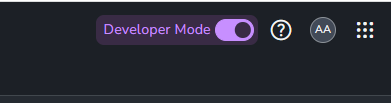

import Tabs from '@theme/Tabs';
import TabItem from '@theme/TabItem';

# Introduction
As the name suggests, the developer mode in AYON facilitates rapid propagation of code changes for developers. It is mainly 
targeted at working with client side pipeline code live from a local repository, without having to re-package and upload changes to the
server all the time. 

This is achieved by incorporating special bundles. By default, bundles on the AYON server are categorized as Production or Staging. However, in developer mode, it is possible to also create a Dev bundles.

## Pre-requisites
- AYON server - 0.5.0
- AYON launcher - 1.0.0-beta.6
- openpype addon - 3.17.3

To make use of the developer mode in the AYON, the user must be configured as a developer and enable it in the WebUI.

:::important
Developer mode only affects the user that has activated it and no-one else. 
:::

### Enabling developer mode
1. Log in to AYON server as admin user.
2. In user settings select your user, enable `Developer` checkbox and save changes.
   
3. `Developer mode` checkbox will appear in the top right corner (you may need to refresh page).
   
4. Enable the checkbox.


## Dev bundle
Dev bundles have almost the same data as standard bundles with a few key differences.

- they cannot be marked as `Production` or `Staging`. 
- It is possible to assign them to a specific user.
- It is possible to change versions of addons or enable/disable them without re-creating the bundle.
- You can define custom path to client side addon code for AYON launcher.

:::note
Custom paths to addons only affects AYON launcher code and has no effect for server side code.
:::

Configuration of custom addon paths have checkbox and path input. If checkbox is disabled the path is ignored and if is enabled then path is used, even if not filled. Point the path to the client code inside repository to be able to have git controlled changes that are directly propagated.

:::note
Some addons have more complicated preparation of code for AYON launcher, in that case it is recommended to modify addon's create package script to extract client code to predefined directory. With that it is still possible to use advantage of developer mode to some degree.
:::

### How to create dev bundle
1. Make sure developer mode is enabled.
2. Go to Bundles page (in Studio settings).
3. Click on `Add new bundle`. You will see `Dev bundle` checkbox and `Assigned dev` field in the form.
4. Make sure `Dev bundle` is enabled.
5. Assign yourself to the bundle. Only one user can be assigned to dev bundle.
6. Choose addons and their versions.
7. Confirm creation of the new bundle.
   

## Working in developer mode

Assuming you have turned on developer mode, created a dev bundle and assigned it to yourself, you can start working with 
live code from AYON addons. The addon you want to work with must also be available on server, so AYON can source settings
for it when working with the pipeline. Therefore you can't do live updates to settings models and have them show up on the server automatically, but if you point for example `maya` addon to you local maya addon folder, you can change all the maya pipeline code and it will be picked up on the fly. 

### Example of custom addon path
Small example how this could be used with [ayon-third-party](https://github.com/ynput/ayon-third-party) addon.

1. Define local directory with code
In this example will be used `C:/code/addons`.
```shell
cd C:/code/addons
```
2. Clone addon repository
```shell
git clone https://github.com/ynput/ayon-third-party
```
3. Create addon package
If addon is already available on server skip to step 5.
```shell
python ./create_package.py
```
4. Upload addon to server
Open AYON server in browser. Go to `Studio settings` and select `Bundles` tab. Click to `Install addon` and upload zip from `C:/code/addons/ayon-third-party/package/`. 
5. Define custom path
Select or create dev bundle. Enable `ayon-third-party` addon. Enable custom path and fill the path to `C:/code/addons/ayon-third-party/client`.
6. **Run AYON launcher**
Start AYON launcher with `--use-dev` argument. This will automatically pick the dev bundle assigned to you.
```shell
"C:/Users/MyUser/AppData/Local/Ynput/AYON/app/AYON 1.0.0-beta.6/ayon.exe" --use-dev
```

AYON launcher will then use code from the location we've defined, rather than downloading it from the server installed version. Try to do changes in the addon locally, restart AYON launcher and validate if changes are propagated.

:::note
It is possible to use dev bundle even if it is not assigned to the user. In that case replace argument `--use-dev` with `--bundle <deb bundle name>`.
:::
