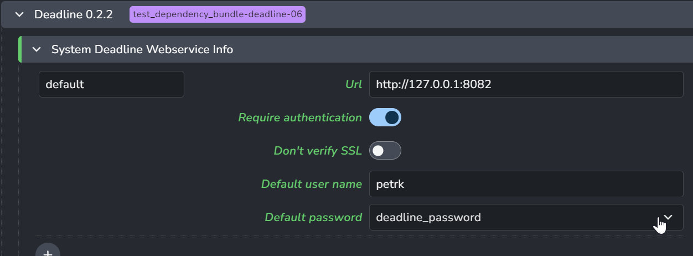
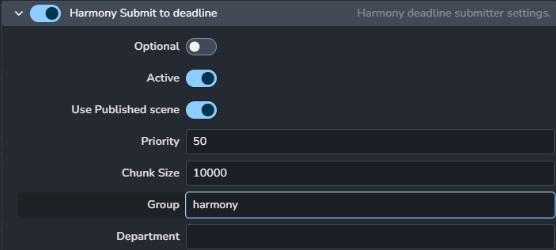

import Tabs from '@theme/Tabs';
import TabItem from '@theme/TabItem';

## Preparation

For [AWS Thinkbox Deadline](https://www.awsthinkbox.com/deadline) support you need to set a few things up in both AYON and Deadline itself

1. Deploy AYON executable to all nodes of Deadline farm. See [Install & Run](admin_desktop_distribute.md)

2. Enable Deadline Module in the [AYON Admin Settings](admin_settings_system.md#deadline).

3. Set up *Deadline Web API service*. For more details on how to do it, see [here](https://docs.thinkboxsoftware.com/products/deadline/10.1/1_User%20Manual/manual/web-service.html).

4. Point AYON to your deadline webservice URL in the [AYON Admin Settings](admin_settings_system.md#deadline).

6. Install our custom plugin and scripts to your deadline repository. It should be as simple as copying content of `ayon/modules/deadline/repository/custom` to `path/to/your/deadline/repository/custom`.

## Configuration

AYON integration for Deadline consists of two parts:

- The `AYON` Deadline Plug-in
- A `GlobalJobPreLoad` Deadline Script (this gets triggered for each deadline job)

The `GlobalJobPreLoad` handles populating render and publish jobs with proper environment variables using settings from the `AYON` Deadline Plug-in.

The `AYON` Deadline Plug-in must be configured to point to a valid AYON executable location. The executable need to be installed to
destinations accessible by DL process. Check permissions (must be executable and accessible by Deadline process)

- Enable `Tools > Super User Mode` in Deadline Monitor

- Go to `Tools > Configure Plugins...`, find `AYON` in the list on the left side, find location of AYON
executable. It is recommended to use the `ayon_console` executable as it provides a bit more logging.

- In case of multi OS farms, provide multiple locations, each Deadline Worker goes through the list and tries to find the first accessible
 location for itself.

##

### AYONTileAssembler Plugin
To setup tile rendering copy the `OpenPypeTileAssembler` plugin to the repository;
`[AYON]\ayon\modules\deadline\repository\custom\plugins\OpenPypeTileAssembler` > `[DeadlineRepository]\custom\plugins\OpenPypeTileAssembler`

### Pools

The main pools can be configured at `ayon+settings://deadline/publish/CollectDeadlinePools`, which is applied to the rendering jobs.

The dependent publishing job's pool uses `ayon+settings://deadline/publish/ProcessSubmittedJobOnFarm`. If nothing is specified the pool will fallback to the primary pool above.

:::note maya tile rendering
The logic for publishing job pool assignment applies to tiling jobs.
:::

## Troubleshooting

:::note guide
You could check [deadline guide](https://community.ynput.io/t/ayon-openpype-deadline-setup/468) for more detailed steps and additional tips.
:::

#### Publishing jobs fail directly in DCCs

- Double check that all previously described steps were finished
- Check that `deadlinewebservice` is running on DL server
- Check that user's machine has access to deadline server on configured port

#### Jobs are failing on DL side

Each publishing from AYON consists of 2 jobs, first one is rendering, second one is the publishing job (triggered after successful finish of the rendering job).

- Jobs are failing with `AYON executable was not found` error

    Check if AYON is installed on the Worker handling this job and ensure `AYON` Deadline Plug-in is properly [configured](#configuration)

- Publishing job is failing with `ffmpeg not installed` error

    AYON executable has to have access to `ffmpeg` executable, check AYON `ayon+settings://ayon_third_party`

    

- Both jobs finished successfully, but there is no review on Ftrack

    Make sure that you correctly set published family to be send to Ftrack.

    

    Example: I want send to Ftrack review of rendered images from Harmony :
        - `Host names`: "harmony"
        - `Families`: "render"
        - `Add Ftrack Family` to "Enabled"

    Make sure that you actually configured to create review for published subset in `ayon+settings://deadline/publish/ProcessSubmittedJobOnFarm`

    

    Example: I want to create review for all reviewable subsets in Harmony :
      - Add "harmony" as a new key an ".*" as a value.

- Rendering jobs are stuck in 'Queued' state or failing

    Make sure that your Deadline is not limiting specific jobs to be run only on specific machines. (Eg. only some machines have installed particular application.)

    Check `ayon+settings://deadline/publish/HarmonySubmitDeadline`

    

    Example: I have separated machines with "Harmony" installed into "harmony" group on Deadline. I want rendering jobs published from Harmony to run only on those machines.
