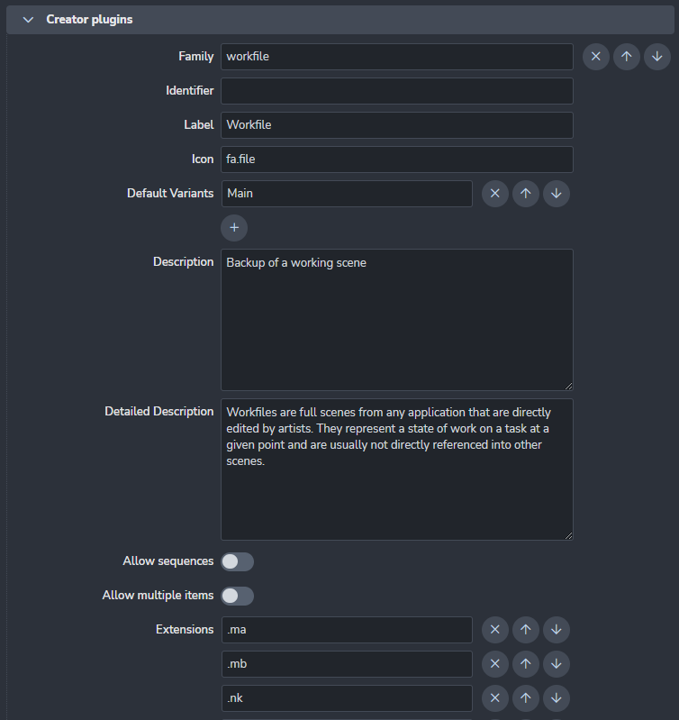

Project settings can have project specific values. Each new project is using studio values defined in **studio settings** but these values can be modified or overridden per project. 

Refer to Settings related to [Working with settings](../admin_settings) for more details.
# Color Management (derived to OCIO)
//

# Simple Create Plugins
Find here the simple create plugins.

Contains list of implemented families to show in middle menu in Tray Publisher. Each plugin must contain:

- **Family**
- **Label**
- **Icon**
- **Extensions**

# Editorial creator plugins
Find here the editorial creator plugins.

**Plugins list:** Editorial simple creator.
# Create plugins
Find here the create plugins.

**Plugins list:** Batch Movie Creator.

# Publish plugins
Find here the publish plugins.

**Plugins list:** Validate frame range, Validate Existing Version.

