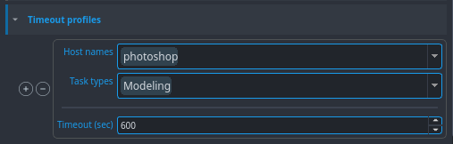

# Color Management (derived to OCIO)
//

# Timeout profiles

Set here the publishing time limit. If it goes above the indicated time, the publishing stops and leaves an error. For example, here, if you are publishing a model on photoshop and the publishing takes more than 600 seconds, it will stop.

- **Host name:** select the software name.

- **Task type:** select the task type.

- **Timeout (sec):** set the publishing time limit in seconds.

# Publish plugins
Find here the publish plugins.

**Plugins list:** Collect Published Files, Collect TVPaint Instances.