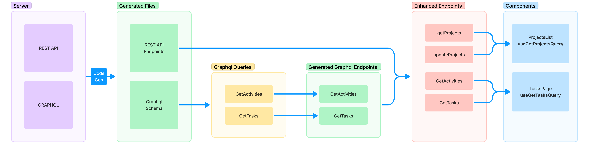
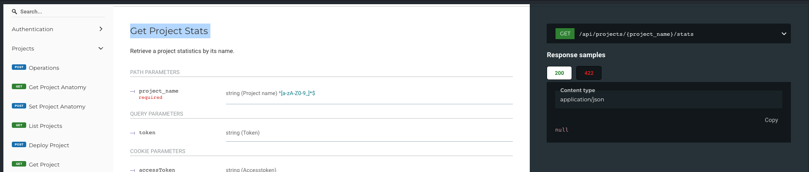
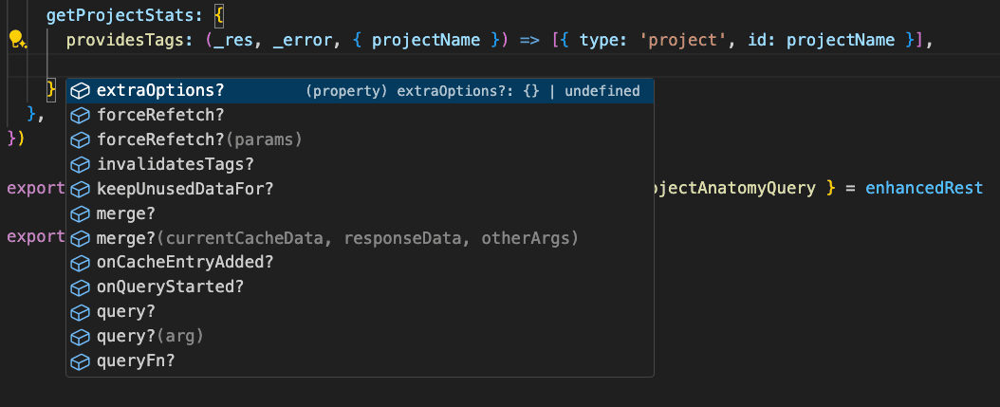
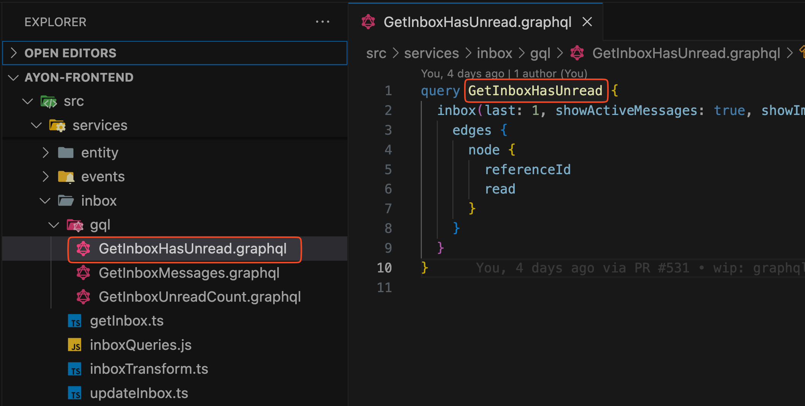
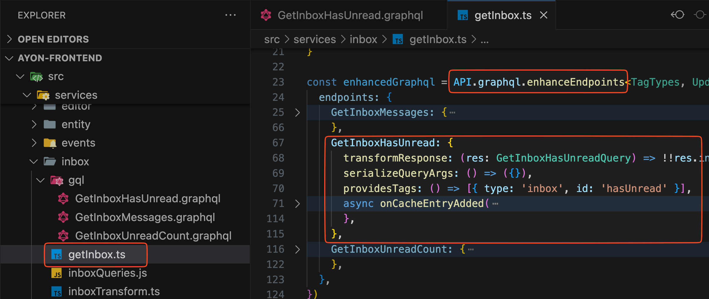
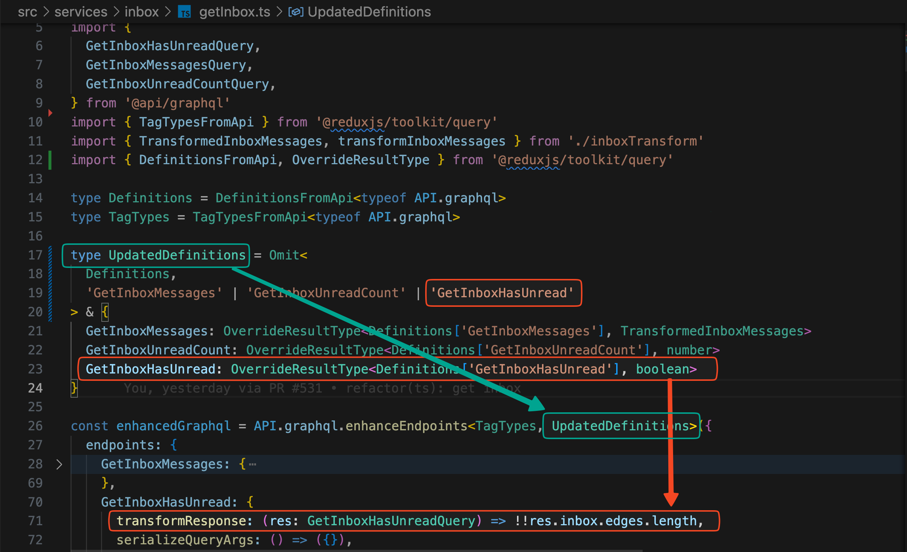
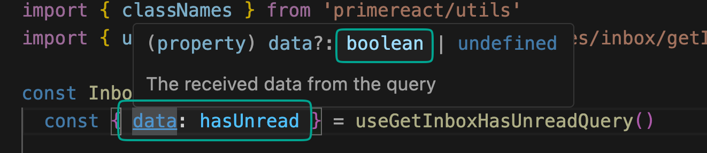

The backend exposes two APIs and redux is setup to handle both under a single api slice.

:::note
There are still a lot of legacy queries that inject instead of enhance. Over time we hope to convert these legacy queries to the new methodology.
:::

-   [REST API](dev_api_rest.md)
-   [GraphQL](dev_api_graphql.md)

## Code Generation

We use code generation tools to automatically generate types and queries based off the restAPI and graphql schema.

Here is an overview of what is generated (green) and how it is consumed in the app.



**RTK Query docs**

[RestAPI openAPI codegen](https://redux-toolkit.js.org/rtk-query/usage/code-generation#openapi)

[Graphql codegen](https://the-guild.dev/graphql/codegen/plugins/typescript/typescript-rtk-query)

## Codegen setup

The generated types are included in the repo but they need to be regenerated every time the API changes or if you write new/update graphql queries.

1. `yarn generate-rest` - This needs to be run every time a new query is used in the code base or when the API changes.
2. Generate graphql types and queries
   a. Set `NAME` and `PASSWORD` values in your `.env.local` file. This can be for any user but I recommend using the admin credentials.
   b. `yarn generate-token` - Fetches an auth token and writes to `.env` . Used by graphql-codegen to get the schema.
   c. `yarn generate-graphql` - Generates types and rtk queries based on the schema and your `.graphql` files.
3. Both code gens create RTK queries. These queries can then be "enhanced" with more config and file separation.
4. All GraphQL queries are generated in one `graphql.ts` file. REST API queries are generated in multiple files under `src/api/rest/{query_name}.ts`

## Generating REST API Queries

Each REST endpoint needs to be explicitly defined inside `gen/openapi-config.ts` and categorized by endpoint type.

```typescript
// Specify the endpoints you want to generate
const outputFiles = {
    bundles: ["listBundles", "checkBundleCompatibility"],
    folders: ["getFolderHierarchy", "getFolderList"],
};
```

In the example above, two files will be generated with their associated endpoints: `src/api/rest/bundles.ts` and `src/api/rest/folders.ts`

:::tip
To enhance IDE performance, the files are now split. This new approach creates individual files for each query, eliminating the significant performance issues associated with the previous method, which generated a single file for all queries.
:::

## Writing and Enhancing RTK Queries

### REST

In this tutorial, we will use the **List Bundles** endpoint as an example.

1. **Locate the Endpoint:**

    - Navigate to `http://localhost:3000/doc/api` to find the endpoint name. Look for `List Bundles -> listBundles`.

    

    :::note
    The query might already be in use. Perform a global search for `listBundles` to check if it's already set up and can be reused.
    :::

2. **Ensure Endpoint Generation:**

    - Once you have identified the endpoint, verify that it has been generated. If it hasn't, add the endpoint name (`listBundles`) to the `outputFiles` list, following the example provided above.
    - Run `yarn generate-rest` again to generate the new query.

3. **Create or Update Service File:**

    - Create a new folder in `/src/services/` (e.g., `bundles`) with a new file `getBundles.ts`, or add it to an existing file if appropriate. In this tutorial, we will add it to `getBundles.ts`.

4. **Import the Correct API:**

    - The generated queries are split into different files. Ensure you import the correct API reference when enhancing these queries. For this example, import the API from `src/api/rest/bundles.ts` as it contains the query.

    

    :::note
    Although the queries have already been "injected" into the api we now "enhance" these queries and then export the enhanced queries as React hooks.
    :::

5. **Enhance the Query:**

    - Perform any necessary enhancements to the query.

    

6. **Export the Enhanced Query:**
    - Export the enhanced query as a hook to be consumed in a React component.

## GraphQL

Writing graphql queries are similar but involve one extra step at the start to define the queries first.

1. Create a folder called inside `/src/services/{queryFolderName}/gql` . This is where you will write your graphql queries. Try to match the folder name to the query name and use PascalCase.

_We use PascalCase so that it's easier to distinguish between rest and graphql queries._



2. Create a new file called {GetQueryName}.graphql and write your query. Intellisense should provide suggestions and eslint should highlight when a field has an error.
   

3. Once finished `run yarn generate-gql`. This will take your new .graphql file and generate a RTK Query from it whilst also generating the matching types.

_You can check this at the bottom of /src/api/graphql.ts _

4. Enhance the query similar to how the rest queries are enhanced; except in this case we use API.graphql.enhanceEndpoints .
   

5. Follow the same steps from step 3 of creating rest queries.

## Typescript overrides

Often you will want to transform the data inside the query to better structure it using transformResponse . Typescript only knows the full queries response type and so we need to tell it that the query will actually respond with our transformed type.

We do this by overriding the result type for the query to match the actual response type. As you can see the the query responds with a boolean and we need to tell typescript this.



Now when we use the query hook we should see the new type we defined as the data. If we hadn't done this then the type would have been the generated query from step 3.


