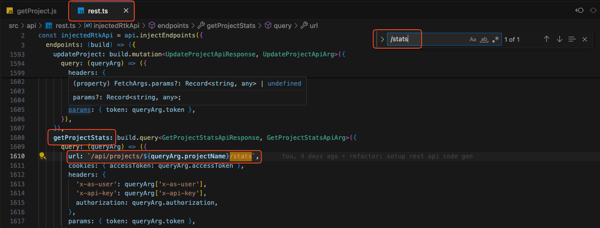
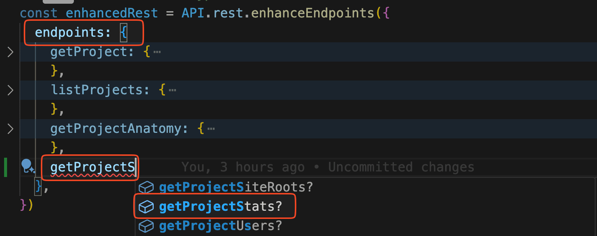
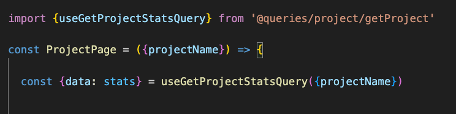

The backend exposes two APIs and redux is setup to handle both under a single api slice.

:::note
There are still a lot of legacy queries that inject instead of enhance. Over time we hope to convert these legacy queries to the new methodology. 
:::

REST - https://ayon.dev/doc/api
GraphQL - https://ayon.dev/explorer

## Code Generation
We use code generation tools to automatically generate types and queries based off the restAPI and graphql schema. 

Here is an overview of what is generated (green) and how it is consumed in the app.

**RTK Query docs**

[RestAPI openAPI codegen](https://redux-toolkit.js.org/rtk-query/usage/code-generation#openapi)

[Graphql codegen](https://the-guild.dev/graphql/codegen/plugins/typescript/typescript-rtk-query)

## Codegen setup
The generated types are included in the repo but they need to be regenerated every time the API changes or if you write new/update graphql queries.

1. `yarn generate-rest` - Only needs to be done periodically if the RestAPI changes.
2. Generate graphql types and queries
    a. Set `NAME` and `PASSWORD` values in your `.env.local` file. This can be for any user but I recommend using the admin credentials.
    b. `yarn generate-token` - Fetches an auth token and writes to `.env` . Used by graphql-codegen to get the schema.
    c. `yarn generate-graphql` - Generates types and rtk queries based on the schema and your `.graphql`  files.
3. Both code gens create RTK queries. These queries can then be "enhanced" with more config and file separation.
4. Both files are created inside `/src/api/` `rest.ts` and `graphql.ts` . They are exported automatically.

:::note
These files will have already been generated and so you probably won't have to do it again.
:::

## Writing RTK Queries

Note: the images reference API.rest and API.graphql but you can now just use api.enhanceEndpoints for both.

### Rest

This is the easiest query to write because it should have already been generated for you by the codegen.

Look at http://localhost:3000/doc/api to see all the endpoints available. Every endpoint will have been created in /src/api/rest.ts as an RTK Query.

Once you have found the endpoint you want to use we can use it's title as the query name. In this case **Get Project Stats** ➝ `getProjectStats` . 

You can always search for the endpoint in rest.ts to check if the query exists.

:::note
The query might already be in use, do a global search for getProjectStats  to see if it's already setup and if you can reuse it.
:::

1. Now either create a new folder in `/src/services/` like projects with a new file `getProjects.ts`. Or you can add it to an already created file if it fits. In this case we will add it to `getProjects.ts`.

:::note
Although the queries have already been "injected" into the api inside rest.ts we always "enhance" these queries and then export the enhanced queries react hooks.
:::

2. Start typing your query name and it should autocomplete if it exists.

3. Do any enhancements required.

4. Export the enhanced query as a hook to be consumed in a react component.

5. Use the react hook inside a component.

## GraphQL

Writing graphql queries are similar but involve one extra step at the start to define the queries first.

1. Create a folder called inside /src/services/{queryFolderName}/gql . This is where you will write your graphql queries. Try to match the folder name to the query name and use PascalCase.
*We use PascalCase so that it's easier to distinguish between rest and graphql queries.*

2. Create a new file called {GetQueryName}.graphql and write your query. Intellisense should provide suggestions and eslint should highlight when a field has an error.

3. Once finished `run yarn generate-gql`. This will take your new .graphql  file and generate a RTK Query from it whilst also generating the matching types.

*You can check this at the bottom of /src/api/graphql.ts *

4. Enhance the query similar to how the rest queries are enhanced; except in this case we use API.graphql.enhanceEndpoints .

5. Follow the same steps from step 3 of creating rest queries.

## Typescript overrides

Often you will want to transform the data inside the query to better structure it using transformResponse . Typescript only knows the full queries response type and so we need to tell it that the query will actually respond with our transformed type.

We do this by overriding the result type for the query to match the actual response type. As you can see the the query responds with a boolean and we need to tell typescript this.

Now when we use the query hook we should see the new type we defined as the data. If we hadn't done this then the type would have been the generated query from step 3.

