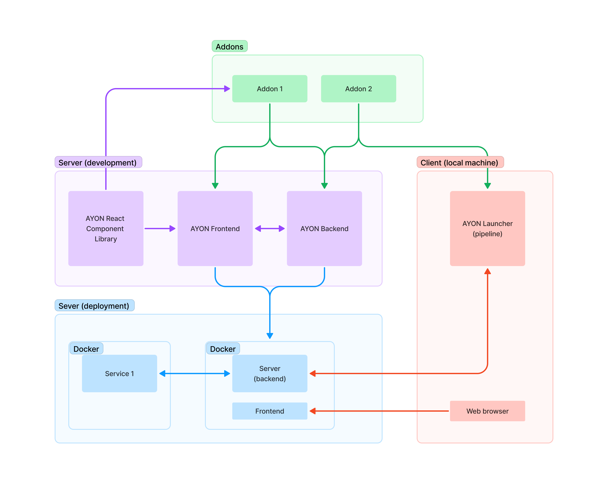

## Getting Started

AYON Server is made up of two main repos, [ayon-backend](https://github.com/ynput/ayon-backend) and [ayon-frontend](https://github.com/ynput/ayon-frontend).

The fastest and easiest way to start testing both together is through docker using [ayon-docker](https://github.com/ynput/ayon-docker).

Once the server is running it can be accessed through the frontend UI using `http//localhost:5000`.

:::tip
Running the docker container is also a great way to start developing on the frontend. Set env variable `SERVER_URL=http//localhost:5000`.
:::

## AYON Overview

This is a general overview of the different parts of AYON. The server development is written in different parts and then deployed as one docker container that interacts with the AYON Launcher (client).

## AYON Backend

-   Python 3.12
-   FastAPI, Strawberry (GraphQL)
-   PostgreSQL (asyncpg), Redis (aioredis)
-   gunicorn/uvicorn server (option to use granian)

## AYON Frontend

-   Yarn, Nodejs 20+, Vite
-   ReactJs
-   Typescript (migration in progress)
-   Redux toolkit with RTK Query
-   AYON React Component Library (ARC)
-   Styled Components

### **Env variables**

Create a `env.local` file in the root directory.

`SERVER_URL=http://localhost:5000` - URL of the backend server

### **Recommended VSCode Extensions**

-   CSS Variable Autocomplete
-   GitHub Pull Requests
-   vscode-styled-components
-   GraphQL: Language Feature Support
-   GraphQL: Syntax Highlighting

## AYON React Component Library (ARC)

The frontend uses a custom component library for colors, fonts and reusable React components. The components are separated so that AYON addons can also utilize them for their UIs. Any component that could be useful for an addon and is not too specific should be created in ARC.

Read more about the style theme of AYON here: [Server Theme](server_theme.md)
